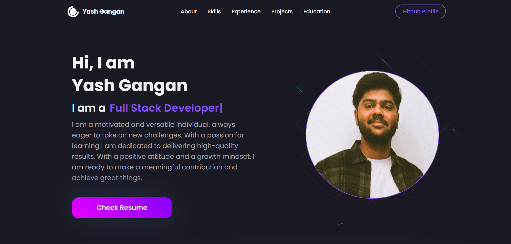

# 🌟 My Portfolio Website 🌟

Welcome to my personal portfolio website! This is a showcase of my work, skills, and experiences as a developer. Built with **React** and **Tailwind CSS**, it's designed to be simple, modern, and fully responsive.

 

## ✨ Live Demo

Check out the live website here: [**My Portfolio**](https://portfolio-yashgangan.vercel.app/)

## 🚀 Features

- 🔥 **Modern UI**: Sleek and minimalist design with smooth animations.
- 📱 **Responsive Design**: Optimized for all devices, from desktops to mobile phones.
- 💼 **Projects Showcase**: A gallery of my key projects, complete with links to GitHub and live demos.
- 💬 **Contact Form**: Simple and functional contact form powered by EmailJS.
- 🌐 **Social Links**: Easy access to my social profiles, including GitHub, LinkedIn, and Twitter.

## 🛠️ Tech Stack

This project is built using the following technologies:

- [React.js](https://reactjs.org/)
- [Tailwind CSS](https://tailwindcss.com/)
- [EmailJS](https://www.emailjs.com/) (for contact form functionality)

